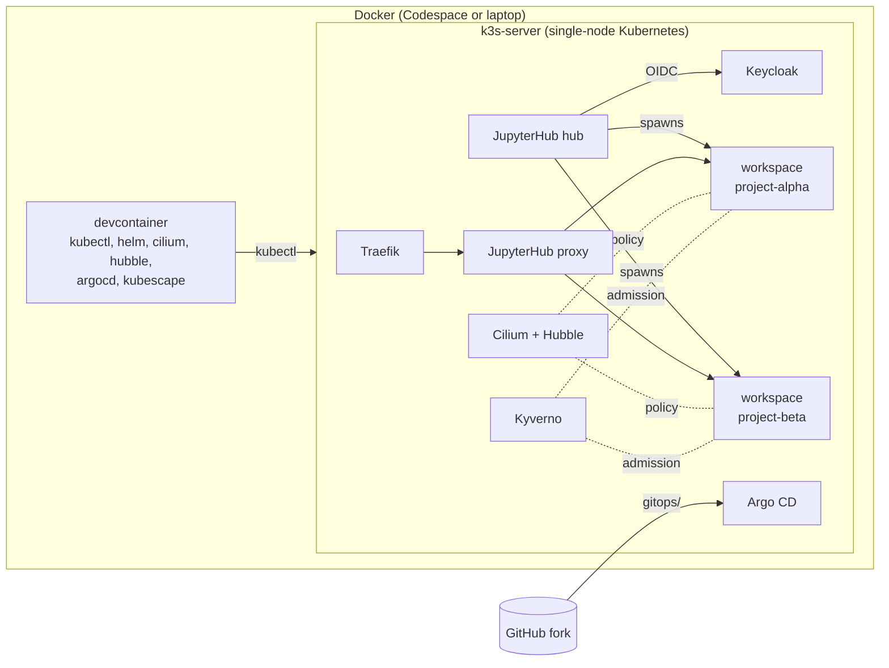

# KID: K8TRE in Docker

A hands-on training environment for **Kubernetes-based Trusted Research Environments**, modelled
on [K8TRE](https://docs.k8tre.org/latest/). It runs a small but realistic TRE inside a dev
container, in **GitHub Codespaces** or on a **16 GB laptop** with VS Code Dev Containers, so
research software engineers can launch workspaces, test the security controls and break things
safely.

📘 **Training docs:** <https://karectl.github.io/kid/> (source in [`docs/`](docs/))

> [!WARNING]
> Training only. Public demo passwords, no in-cluster TLS, single node, no airlock. Never put real
> data in it.

## What it demonstrates

| Topic | How |
|---|---|
| Per-project workspaces on demand | JupyterHub spawns each user's JupyterLab into the `project-<name>` namespace they chose, filtered by Keycloak group |
| Workspace isolation | Cilium network policy (explicit allow-list + Kyverno-generated default-deny), least-privilege RBAC, per-namespace storage |
| Restricted internet access | No egress by default; opt-in per-project FQDN allow-lists |
| Network visibility | Hubble CLI and Hubble UI |
| Storage provisioning and control | Named StorageClasses, per-user-per-project home PVCs, project shared PVC, storage quotas |
| CPU and memory limits | Workspace sizes, LimitRange, ResourceQuota |
| Guardrails as code | Kyverno: approved registries, no privileged/host access, project labels, audit `:latest` |
| Security posture | Kubescape CLI scans of the cluster and of Git |
| GitOps | Argo CD app-of-apps that follows *your* fork and branch |

## Quick start

### GitHub Codespaces (recommended)

1. **Fork** this repository (keep it public).
2. **Code → Codespaces → New with options** → machine type **4-core / 16 GB** → Create.
3. Wait for `Bootstrap complete` in the terminal (~5 min), then run `tre status` until everything
   is `Synced/Healthy` (~5–10 min more).
4. Open port **80** from the **Ports** tab, or run `tre info` for all URLs and passwords.

### Local (VS Code Dev Containers)

Requirements: Docker with **≥ 8 GB** memory for containers, VS Code + Dev Containers extension.

```bash
git clone https://github.com/<you>/kid.git && cd kid && code .
# "Reopen in Container", wait for the bootstrap, then open http://localhost/
```

Port 80 taken? `export TRE_HTTP_PORT=8080` before opening the container. Short on memory?
`export KID_ENABLE_KYVERNO=false`. Full details:
[Getting started](https://karectl.github.io/kid/getting-started/).

### Demo accounts

| User | Password | Can launch in |
|---|---|---|
| `researcher1` | `researcher` | project-alpha |
| `researcher2` | `researcher` | project-beta |
| `researcher3` | `researcher` | alpha or beta |
| `researcher4` | `researcher` | nothing (not in a project) |
| `tre-admin` | `admin` | JupyterHub admin panel |

Keycloak console `admin`/`admin`; Argo CD `admin`/password from `tre info`.

## Architecture



`bootstrap.sh` installs Cilium (with Hubble) and Argo CD, then points an Argo CD "root" app at
`gitops/apps` in your fork and branch. Argo CD deploys everything else. Components and budget:

| Component | Namespace | ~Memory |
|---|---|---|
| k3s (+ Traefik, CoreDNS, local-path, metrics-server) | kube-system | 700 MB |
| Cilium + Hubble relay/UI | kube-system | 450 MB |
| Argo CD (trimmed) | argocd | 450 MB |
| Keycloak (dev mode) | keycloak | 600 MB |
| JupyterHub hub + proxy | jupyterhub | 200 MB |
| Kyverno (optional) | kyverno | 300 MB |
| Each workspace | project-* | 0.2–2 GB |

## Repository layout

```text
.devcontainer/        dev container, k3s compose file, bootstrap.sh, pinned versions
gitops/
  root-app.yaml       Argo CD app-of-apps template (filled in by bootstrap.sh)
  apps/               Helm chart -> one Argo CD Application per component and per project
    values.yaml       <- research projects are declared here
  projects/chart/     namespace, quota, limits, storage, RBAC, network policy for one project
  jupyterhub/         Z2JH values, RBAC; files/tre_config.py = project-aware spawning
  keycloak/           Keycloak + realm (users, project groups, group claim)
  kyverno/            ClusterPolicies
  network-policies/   Cilium policy for JupyterHub itself
  platform/           StorageClasses, Hubble UI ingress
  portal/             landing page
scripts/tre           helper: info | status | workspaces | usage | hubble | sync | bootstrap
scripts/validate.sh   static checks (also run in CI)
tests/                spawner unit tests, JupyterHub end-to-end harness, Kyverno policy tests
docs/, zensical.toml  training documentation (Zensical)
```

## Labs

1. Orientation · 2. Workspaces on demand · 3. Project isolation with Hubble · 4. Internet egress ·
5. Storage · 6. CPU and memory · 7. A new project via GitOps · 8. Kyverno guardrails ·
9. Kubescape posture · 10. Challenges. See the [labs](https://karectl.github.io/kid/labs/).

## Development

```bash
scripts/validate.sh                                   # helm, kustomize, kubeconform (needs the CLIs)
pip install -r tests/requirements.txt && pytest tests # JupyterHub project logic
tests/e2e/run.sh                                      # real hub: login -> spawn, pod checked vs policies
kyverno test tests/kyverno                            # Kyverno policies
pip install zensical && zensical serve                # docs at http://localhost:8000
```

CI (`.github/workflows/validate.yml`) runs the same checks on every push and pull request.
`.github/workflows/docs.yml` publishes the docs to GitHub Pages from `main`. Enable it once under
**Settings → Pages → Source: GitHub Actions**.

The starting point, design decisions and trade-offs are recorded in the
[implementation plan](docs/facilitator/implementation-plan.md).
