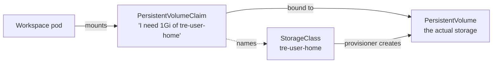

# Storage

## Building blocks



* A **StorageClass** says *how* to create storage (which provisioner, reclaim policy, binding mode).
* A **PersistentVolumeClaim (PVC)** is a namespaced *request* for storage.
* A **PersistentVolume (PV)** is cluster-scoped: the storage that satisfies a claim.

Only pods in the **same namespace** as a PVC can mount it. That single rule is what stops
project-beta from mounting project-alpha's data.

## StorageClasses in KID

Defined in `gitops/platform/storageclasses.yaml`. K8TRE's storage spec asks applications to use
**named** classes rather than the cluster default, so that retention and backup behaviour is explicit.

| Class | Reclaim policy | Used for |
|---|---|---|
| `tre-user-home` | **Delete**: data goes when the PVC is deleted | Per-user home directories |
| `tre-project-shared` | **Retain**: the PV and data stay when the PVC is deleted | Project shared area |
| `local-path` (k3s default) | Delete | Platform only (JupyterHub's database). **Blocked in projects by quota** |

Both TRE classes use the k3s `rancher.io/local-path` provisioner, which creates a directory on
the node under `/var/lib/rancher/k3s/storage/`. `volumeBindingMode: WaitForFirstConsumer`
means the volume is created only when a pod first uses it.

## Volumes in a workspace

| Mount | PVC | Scope | Created by |
|---|---|---|---|
| `/home/jovyan` | `home-<username>` | One user, **one project**: researcher3 has a different home in alpha and beta | KubeSpawner, on first spawn |
| `/home/jovyan/shared` | `project-shared` | All members of the project | Project chart |

## Controls

* **Quota**: `ResourceQuota/project-quota` limits `requests.storage` (total GiB),
  `persistentvolumeclaims` (count) and **forbids the `local-path` class** with
  `local-path.storageclass.storage.k8s.io/persistentvolumeclaims: "0"`.
* **LimitRange**: a single PVC in a project may request at most 5 GiB.

!!! warning "Demo limitations"
    * `local-path` doesn't enforce the requested size: a 1 GiB claim can grow until the node disk is
      full. Real TRE storage (Longhorn, cloud disks, NFS with quotas) enforces capacity.
    * Local-path volumes are `ReadWriteOnce`, which Kubernetes enforces per **node**. On our single
      node every pod of a project can share `project-shared`. A multi-node TRE needs a
      `ReadWriteMany` class (NFS, Azure Files, CephFS).
    * Data sits unencrypted in a directory on the node, and anyone with node access can read it.
      That is why node access, encryption at rest and operator trust matter so much in a TRE.

## Commands

```bash
kubectl get storageclass
kubectl get pvc -A
kubectl get pv -o custom-columns=NAME:.metadata.name,CLAIM:.spec.claimRef.name,NS:.spec.claimRef.namespace,CLASS:.spec.storageClassName,RECLAIM:.spec.persistentVolumeReclaimPolicy,STATUS:.status.phase
kubectl -n project-alpha describe resourcequota project-quota
```
