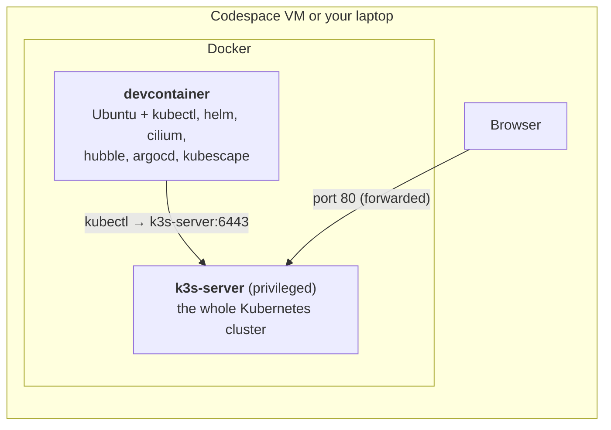
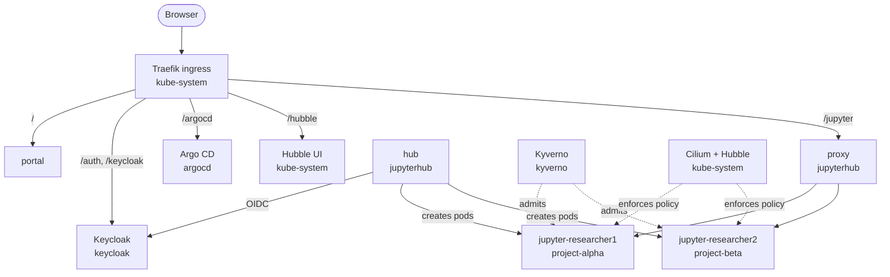
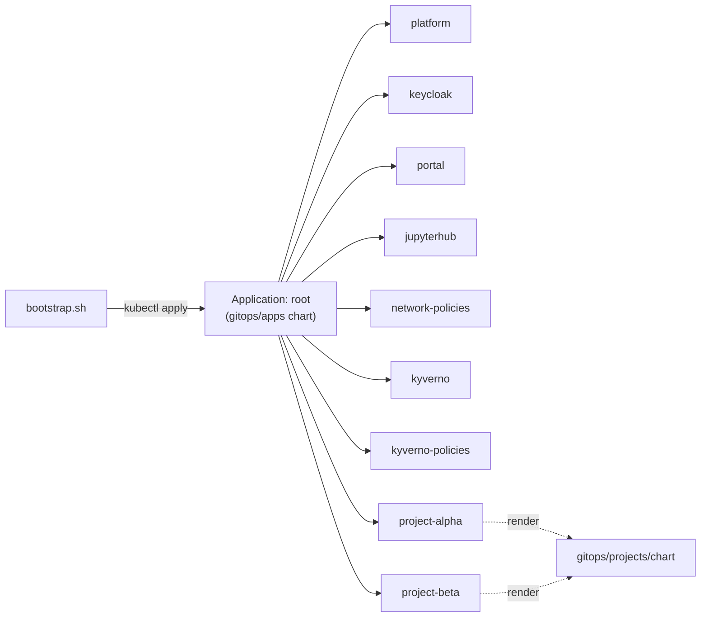

# Architecture of KID

## Containers on your machine

* **devcontainer** is where you type commands. It has no Kubernetes inside; it talks to the API
  server in `k3s-server` using `~/.kube/config`.
* **k3s-server** runs the control plane, the kubelet and containerd. All TRE pods run *inside*
  this container, which is why it must be privileged. It starts with flannel and the built-in
  network-policy controller turned off, so that **Cilium** can own pod networking.

Defined in [`.devcontainer/docker-compose.yml`](https://github.com/karectl/kid/blob/main/.devcontainer/docker-compose.yml).

## Inside the cluster

Also in `kube-system`: CoreDNS, the local-path storage provisioner and metrics-server (all bundled
with k3s).

### URL map

| Path | Service | Notes |
|---|---|---|
| `/` | `portal/portal` | Static landing page |
| `/jupyter/` | `jupyterhub/proxy-public` | JupyterHub and every workspace (`/jupyter/user/<name>/`) |
| `/auth/` | `keycloak/keycloak` | OIDC endpoints and account pages |
| `/keycloak` | redirect | Shortcut to the Keycloak admin console |
| `/argocd/` | `argocd/argocd-server` | Argo CD UI |
| `/hubble/` | `kube-system/hubble-ui` | Hubble UI (no login, demo only) |

### Namespaces

| Namespace | Managed by | Contains |
|---|---|---|
| `kube-system` | k3s, Cilium CLI, Argo CD (`platform`) | Cilium, Hubble, Traefik, CoreDNS, local-path, metrics-server |
| `argocd` | bootstrap script | Argo CD |
| `keycloak` | Argo CD (`keycloak`) | Keycloak in dev mode |
| `jupyterhub` | Argo CD (`jupyterhub`, `network-policies`) | Hub, proxy, hub database PVC |
| `kyverno` | Argo CD (`kyverno`, `kyverno-policies`) | Kyverno controllers |
| `portal` | Argo CD (`portal`) | Landing page |
| `project-alpha`, `project-beta` | Argo CD (`project-*`) + Kyverno | Workspaces and project storage |

## How it is deployed

1. `bootstrap.sh` installs **Cilium** (with Hubble) and **Argo CD** imperatively, because
   everything else depends on them.
2. It then applies one Argo CD `Application` called **root**, pointing at `gitops/apps` in *your*
   repository and branch.
3. `gitops/apps` is a small Helm chart that renders one `Application` per component and one per
   research project (from the `projects:` list in its `values.yaml`).
4. Argo CD syncs each of those, in **sync waves**: platform/identity first (wave 0), then
   JupyterHub and policies (wave 1), then projects (wave 2).

The repository layout is described in [Repository layout](../reference/repo-layout.md).

## Memory budget

| Component | Typical RSS |
|---|---|
| k3s (all control-plane processes, containerd, CoreDNS, Traefik, metrics-server) | ~700 MB |
| Cilium agent + operator + Hubble relay/UI | ~450 MB |
| Argo CD (4 components) | ~450 MB |
| Keycloak | ~500–600 MB |
| JupyterHub hub + proxy | ~200 MB |
| Kyverno (3 controllers) | ~300 MB |
| **Platform total** | **~3 GB** |
| Each running workspace | 150–400 MB idle, up to its limit (1–2 GB) |

Check the live numbers with `tre usage`. See [Resource budget](../reference/resource-budget.md) for
tips on small laptops.

## What a production TRE adds

KID leaves these out on purpose. Each is a good discussion topic:

* **TLS everywhere** (cert-manager) and **mTLS** between services (Cilium or a service mesh).
* **Secrets management**: External Secrets + a vault instead of passwords in Git.
* **Highly available** control plane, multiple nodes, **RWX storage**, backups and DR.
* **Airlock / egress review** for data coming in and results going out.
* **Private image registry** with scanning and signing (the Kyverno policy then verifies signatures).
* **Package mirrors** (PyPI/CRAN/conda) instead of direct internet allow-lists.
* **Central logging and SIEM**, Hubble flow export, audit logging of the Kubernetes API.
* **Node hardening**, encryption at rest, confidential computing where needed.
* **Remote desktops** (Guacamole) and GPU scheduling.
* A **project lifecycle backend** (K8TRE's cr8tor) instead of editing YAML by hand.
