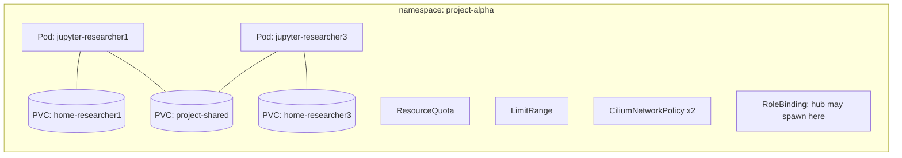

# Kubernetes for TRE people

You already know what a TRE has to do: keep projects apart, stop data leaving, give researchers
compute and storage, and prove all of this to an auditor. This page maps those ideas onto the
Kubernetes objects you will meet in the labs. It is not a complete Kubernetes course.

## The cluster

A **cluster** is a set of machines (**nodes**) run by a **control plane**. The control plane's
**API server** is the only front door: `kubectl`, JupyterHub, Argo CD and Kyverno all make
requests to it. Every object in the cluster is a record stored behind that API.

KID runs a single-node cluster using [k3s](https://k3s.io/), a lightweight Kubernetes
distribution, inside a Docker container called `k3s-server`.

```bash
kubectl get nodes -o wide
kubectl api-resources | head -30     # every kind of object this cluster understands
```

## Declarative objects and controllers

You never tell Kubernetes *"start a container"*. You tell it *"this is how things should be"*
(a YAML object) and **controllers** keep making reality match. Delete a pod that belongs to a
Deployment and a new one appears. That idea runs through everything in a Kubernetes TRE:
network rules, quotas and policies are all objects, and something keeps enforcing them.

```yaml
apiVersion: v1          # which API group/version
kind: ConfigMap         # what sort of object
metadata:
  name: example         # its name...
  namespace: portal     # ...inside this namespace
  labels:               # key/value tags that other objects select on
    app: portal
data:
  greeting: hello
```

## The objects you'll meet

| Object | What it is | TRE analogy |
|---|---|---|
| **Pod** | One or more containers scheduled together, with one IP address | A running workspace VM |
| **Namespace** | A named partition of the cluster; most objects live in one | A project / tenant boundary |
| **Label** | A key/value tag, e.g. `k8tre.io/project=alpha` | Asset tagging, used by policy |
| **Deployment** | Keeps *N* copies of a pod running | A managed service |
| **Service** | A stable name and virtual IP in front of pods | Internal DNS / load balancer |
| **Ingress** | HTTP routing from outside into Services | Reverse proxy / gateway |
| **PersistentVolumeClaim (PVC)** | A request for storage ("1 GiB, this class") | A project or home drive |
| **PersistentVolume (PV)** | The actual storage that satisfies a claim | The disk/share itself |
| **StorageClass** | A *kind* of storage and how to create it | Storage tier / policy |
| **ResourceQuota** | Totals a namespace may use (CPU, memory, storage, pods) | Project allocation |
| **LimitRange** | Default and maximum per container in a namespace | VM size policy |
| **ServiceAccount** | An identity for software running in the cluster | Service principal |
| **Role / ClusterRole** | A list of allowed API actions | Permission set |
| **RoleBinding** | "This identity gets this role in this namespace" | Group membership |
| **CiliumNetworkPolicy** | Allowed network flows for selected pods | Firewall rules |
| **CustomResourceDefinition (CRD)** | Teaches the API a new kind of object | Plug-in schema |

## Namespaces are the project boundary

In K8TRE, and in KID, each research project is a namespace called `project-<name>`. Almost every
control is scoped to it:



A namespace on its own does **not** isolate network traffic. By default any pod can reach any
other pod in the cluster. Network isolation comes from network policy (lab 3).

## Labels and selectors

Much of Kubernetes is wired together by **selecting on labels** rather than naming things.
A Service finds its pods by label, and a network policy picks the pods it applies to and the
peers it allows by label. The same goes for Kyverno, which picks namespaces by label.

```bash
kubectl get pods -A -l component=singleuser-server       # every workspace
kubectl get ns -l k8tre.io/type=project                  # every project
```

So labels are security-relevant. That is why a Kyverno policy in KID checks that workspace pods
carry the right project label.

## Requests, limits and quotas

Each container can declare:

* **requests**: what the scheduler reserves for it on a node (guaranteed).
* **limits**: the hard ceiling. CPU above the limit is *throttled*; memory above the limit gets
  the process **OOM-killed**.

A **LimitRange** fills in defaults and enforces a per-container maximum. A **ResourceQuota**
caps the namespace total. Lab 6 shows all three.

## RBAC: who may do what

Every API request is made by an identity (a user or a ServiceAccount) and checked against
**Roles** bound to it. In KID, JupyterHub's ServiceAccount `hub` can create pods only in
namespaces where a project has bound the `tre-workspace-spawner` ClusterRole to it. Cluster-wide
it can only *read* namespaces.

```bash
kubectl auth can-i create pods -n project-alpha --as system:serviceaccount:jupyterhub:hub   # yes
kubectl auth can-i create pods -n keycloak      --as system:serviceaccount:jupyterhub:hub   # no
```

## Admission control

Before an object is stored, the API server passes it through **admission controllers**. They
can change it (*mutating*) or reject it (*validating*). KID uses three:

1. **LimitRanger** (built in): adds default requests/limits.
2. **Pod Security Admission** (built in): enforces the `baseline` profile on project namespaces.
3. **Kyverno** (a webhook): your own policies, written as YAML.

## Operators, CRDs and Helm

* A **CRD** adds a new object type (Cilium adds `CiliumNetworkPolicy`, Argo CD adds
  `Application`, Kyverno adds `ClusterPolicy`).
* An **operator/controller** watches those objects and acts on them.
* **Helm** packages many YAML files into a *chart* with parameters (*values*). KID uses the
  JupyterHub and Kyverno charts, plus two small charts of its own.
* **Kustomize** patches and combines YAML without templates. Argo CD supports both.

## GitOps

Instead of running `kubectl apply` by hand, **Argo CD** watches a Git repository and applies what
it finds, continuously. Git becomes the audit log and the change-control process for the
platform. See [Argo CD](../components/argocd.md).
