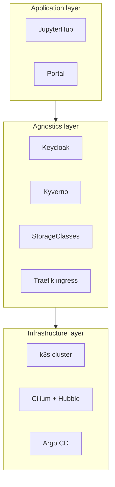
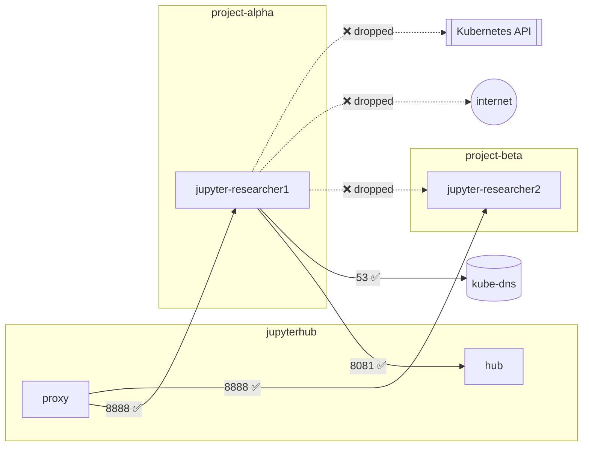

# TREs on Kubernetes

## Why Kubernetes for a TRE?

Traditional TREs are usually built from virtual machines: one or more VMs per project, network
security groups, file shares and a remote-desktop gateway. That works, but it is slow to
provision, expensive when idle and hard to keep consistent.

A Kubernetes-based TRE such as K8TRE swaps many of those pieces for **declarative, API-driven
equivalents**:

| TRE requirement | VM-based TRE | Kubernetes TRE (K8TRE / KID) |
|---|---|---|
| Project boundary | Separate VNet/subnet, resource group | Namespace + network policy + RBAC |
| Workspace | VM per user, often always on | Pod per user session, started on demand, culled when idle |
| Software environment | VM image, manually patched | Container image, rebuilt and scanned in CI |
| Network rules | NSGs / firewall appliances | CiliumNetworkPolicy (identity-based, L3–L7, DNS-aware) |
| Network audit | Flow logs, often sampled | Hubble: every flow with pod/namespace identity |
| Storage | File shares per project | PVCs from named StorageClasses, scoped to namespace |
| Compute limits | VM sizes | Requests/limits, LimitRange, ResourceQuota |
| Configuration drift | Runbooks, periodic audits | GitOps: Argo CD continuously reconciles from Git |
| Guardrails | Azure Policy / manual review | Admission control (Pod Security, Kyverno) |
| Posture assessment | Periodic pen-tests | Continuous scanning (Kubescape) + pen-tests |

## Mapping to the Five Safes

| Safe | Where it shows up in KID |
|---|---|
| **Safe people** | Keycloak accounts and groups; only project members may launch in a project |
| **Safe projects** | A project is a declared, reviewed object in Git (`gitops/apps/values.yaml`) |
| **Safe settings** | Namespaces, default-deny networking, no internet, admission policies, Hubble audit |
| **Safe data** | Per-project storage that can only be mounted inside the project's namespace |
| **Safe outputs** | *Not implemented in KID.* A real TRE adds an airlock / output-checking workflow |

## The K8TRE layers

K8TRE describes three layers. KID contains a laptop-sized slice of each:

| K8TRE component | In KID? | Notes |
|---|---|---|
| Cilium CNI with Hubble | ✅ | Same as K8TRE |
| Argo CD app-of-apps | ✅ | Single cluster, no dev/stg/prod promotion |
| Keycloak | ✅ | Dev mode, realm imported at start-up |
| JupyterHub with per-project namespaces | ✅ | Projects discovered from namespace labels instead of the cr8tor backend |
| Kyverno | ✅ | K8TRE uses policy for guardrails too |
| Gateway API (Cilium Gateway) | ➖ | KID uses k3s' bundled Traefik Ingress to save memory |
| cert-manager / TLS everywhere | ❌ | Codespaces terminates TLS for us |
| External Secrets Operator | ❌ | Demo secrets are in Git (never do this for real) |
| Longhorn / cloud storage | ➖ | k3s local-path, wrapped in TRE-named StorageClasses |
| CloudNativePG | ❌ | JupyterHub uses SQLite on a PVC |
| Guacamole / desktops | ❌ | JupyterLab only |
| cr8tor / project backend | ❌ | Projects are declared in Git; membership in Keycloak |

## Workspace isolation in one picture

Isolation comes from **several independent layers**, so one mistake does not expose everything:

1. **Identity**: Keycloak groups decide which projects you can choose.
2. **Authorisation**: JupyterHub re-checks membership at spawn time.
3. **RBAC**: the hub can only create pods where a project has granted it.
4. **Network**: two Cilium policies (explicit allow-list plus a Kyverno-generated default-deny).
5. **Storage**: PVCs can only be mounted by pods in the same namespace.
6. **Admission**: Pod Security and Kyverno block privileged pods, host access and unapproved images.
7. **Resources**: limits and quotas stop one workspace starving the others.
