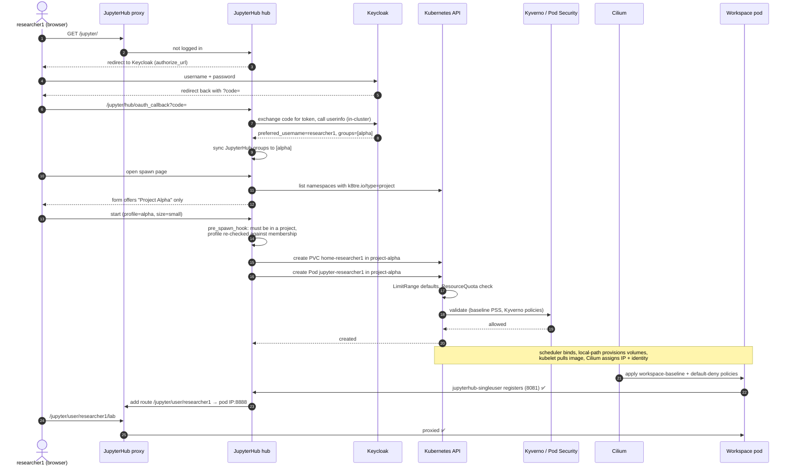

# Life of a workspace

This page follows `researcher1` from the login page to a running JupyterLab, naming every
component on the way. Keep it open during [lab 2](../labs/02-workspaces.md).

## Where each decision is made

| Step | Decision | Configured in |
|---|---|---|
| 8–9 | Which groups the user is in | Keycloak realm (`gitops/keycloak/realm-tre.json`), group mapper on the `jupyterhub` client |
| 10 | Groups copied into JupyterHub | `manage_groups`, `auth_state_groups_key` in `gitops/jupyterhub/values.yaml` |
| 12–13 | Which projects are offered | `project_profiles()` in `gitops/jupyterhub/files/tre_config.py` |
| 15 | Refuse users without a project; refuse forged profiles | `require_a_project()` + KubeSpawner's profile validation |
| 16 | Where home directories live and how big | `singleuser.storage` in `values.yaml`, StorageClass `tre-user-home` |
| 17 | Image, CPU, memory, namespace | Namespace annotations written by `gitops/projects/chart` |
| 18 | Default limits, project totals | `limitrange.yaml`, `resourcequota.yaml` in the project chart |
| 19 | What may run at all | Namespace PSA labels, `gitops/kyverno/*.yaml` |
| 21 | Who may talk to the workspace and where it may connect | `networkpolicy.yaml` in the project chart, Kyverno `generate-default-deny` |
| end | When the workspace is stopped | `cull.timeout` (1 hour idle) in `values.yaml` |

## Stopping

When the user clicks **Stop My Server** (or the culler stops it after an hour idle), the hub deletes
the **pod**. The **PVCs stay**, so files in `~` and `~/shared` are still there next time. The
project's `ResourceQuota` usage drops straight away.
