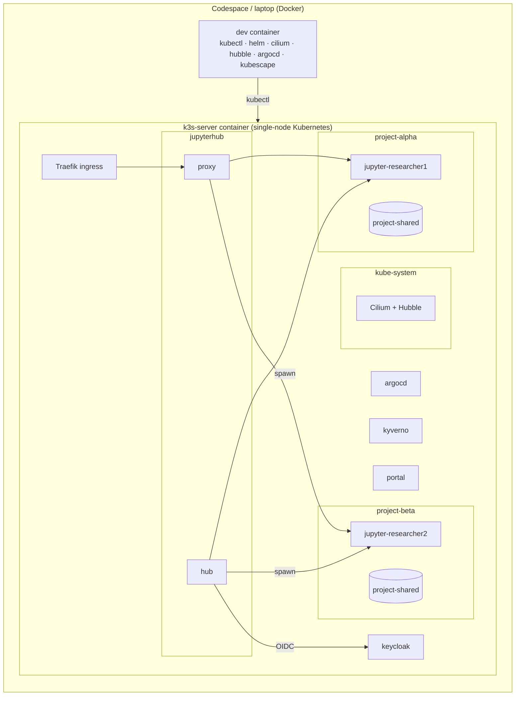

# Implementation plan

This page records the plan used to turn the original `karectl-demo` dev container into the
**K8TRE in Docker (KID)** training environment. It is kept in the docs so facilitators can see
*why* things are built the way they are.

## 1. Goals and non-goals

**Goals**: a hands-on demonstrator that lets junior research software engineers see, touch and break
the core mechanisms of a Kubernetes-based Trusted Research Environment (TRE), modelled on the
[K8TRE](https://docs.k8tre.org/latest/) reference implementation:

| # | Learning outcome | Mechanism demonstrated |
|---|------------------|------------------------|
| 1 | Workspaces are created on demand, per user, per project | JupyterHub + KubeSpawner spawning pods into `project-<name>` namespaces |
| 2 | Projects are isolated from each other | Namespaces, CiliumNetworkPolicy default-deny, RBAC |
| 3 | Internet access is blocked by default and allowed by exception | Cilium egress policy, FQDN-based allow lists |
| 4 | Network behaviour is observable and auditable | Hubble CLI and Hubble UI |
| 5 | Storage is provisioned and scoped per user and per project | StorageClasses, PVCs, per-project shared volumes |
| 6 | CPU and memory are bounded | Container limits, LimitRange, ResourceQuota |
| 7 | Guardrails are enforced as code | Kyverno admission and generate policies |
| 8 | Security posture can be assessed | Kubescape scans |
| 9 | The platform is declared in Git | Argo CD app-of-apps |
| 10 | Identity drives authorisation | Keycloak groups → JupyterHub groups → allowed projects |

**Non-goals**: this is *not* a production TRE. There is no TLS inside the cluster, no secrets manager,
no airlock or egress review, no backup, no HA, and credentials are hard-coded demo values.

## 2. Constraints

* Runs in **GitHub Codespaces** (4 cores / 16 GB) *and* locally in **VS Code Dev Containers**.
* Must fit a **16 GB laptop**; the target is ≤ 6–7 GB of RAM in steady state with two notebooks running
  (Docker Desktop should be given 8–10 GB).
* Works on **amd64 and arm64** (Apple Silicon) hosts.
* Trainees can **fork** (full GitOps loop) or **clone** (read-only GitOps, everything else works).

## 3. Review of the starting point

What already existed and worked well (kept):

* Docker Compose dev container with a privileged **k3s** server container (flannel and the k3s
  network-policy controller disabled so Cilium owns networking), bpffs mounted for Cilium.
* `bootstrap.sh` that installs Cilium, waits for Traefik, installs Argo CD and applies a root app.
* Argo CD app-of-apps with Keycloak, JupyterHub (Z2JH chart via Kustomize), a portal and a
  JupyterHub CiliumNetworkPolicy.
* Traefik ingress with path routing: `/`, `/auth`, `/jupyter`, `/argocd`.

Gaps identified (addressed by this plan):

| Gap | Impact | Fix |
|-----|--------|-----|
| Argo CD `repoURL`/`targetRevision` hard-coded to a personal repo and branch | Forks would deploy someone else's code | Templated root app; child apps rendered by a tiny Helm chart from `repoURL`/`revision` values detected at bootstrap |
| Only `https://` public URLs assumed | Local (non-Codespaces) login breaks | `PUBLIC_URL` in the `cluster-domain` ConfigMap, `http://localhost` locally |
| All notebooks spawn into the `jupyterhub` namespace | No project isolation to demonstrate | Per-project namespaces selected via KubeSpawner profiles |
| No persistent storage (`storage.type: none`) | Can't teach storage | StorageClasses + per-user home PVC + per-project shared PVC |
| No Hubble | Can't *see* policies | Hubble relay + UI enabled, UI at `/hubble`, `hubble` CLI in dev container |
| No Kyverno / Kubescape | Can't teach guardrails | Kyverno via Argo CD; Kubescape CLI in the dev container |
| amd64-only tool downloads | Fails on Apple Silicon | `TARGETARCH`-aware Dockerfile |
| No docs, no README | Unusable for trainees | Zensical site + GitHub Pages workflow + README |

## 4. Target architecture

### Components and budget

| Component | Namespace | Approx. memory | Why it is here |
|-----------|-----------|----------------|----------------|
| k3s (API server, controller, scheduler, kubelet, containerd, CoreDNS, Traefik, local-path, metrics-server) | – / kube-system | ~700 MB | The cluster |
| Cilium agent + operator + Hubble relay + UI | kube-system | ~450 MB | CNI, network policy, observability |
| Argo CD (server, repo-server, controller, redis; dex, notifications and ApplicationSet scaled to 0) | argocd | ~450 MB | GitOps |
| Keycloak (`start-dev`, heap capped) | keycloak | ~600 MB | Identity |
| JupyterHub hub + proxy | jupyterhub | ~250 MB | Workspace orchestration |
| Kyverno admission + background + reports (cleanup controller disabled) | kyverno | ~300 MB | Policy |
| Portal (nginx) | portal | ~10 MB | Landing page |
| Notebook servers | project-* | 256 MB request / 1–2 GB limit each | Workspaces |
| Kubescape | *CLI only* | 0 in-cluster | Posture scanning without running the operator |

Estimated steady state: **~3 GB** for the platform, plus notebooks.

## 5. Design decisions

1. **k3s in Docker Compose (kept)** rather than kind: it's already working, bundles Traefik,
   local-path and metrics-server, and matches K8TRE's on-prem K3s target.
2. **Projects are namespaces.** Following K8TRE (`project-<name>`), each project gets a namespace
   labelled `k8tre.io/type=project` and `k8tre.io/project=<name>`. A project Helm chart
   (`gitops/projects/chart`) stamps out: Namespace (with Pod Security Admission labels),
   ResourceQuota, LimitRange, shared PVC, hub RoleBinding, and workspace network policy.
   Projects are declared as a list in `gitops/apps/values.yaml`; Argo CD creates one Application
   per project.
3. **Project membership comes from Keycloak groups.** A user in Keycloak group `alpha` may launch
   workspaces in `project-alpha`. OAuthenticator's `manage_groups` syncs groups on login.
4. **JupyterHub discovers projects from the cluster.** The hub lists namespaces labelled
   `k8tre.io/type=project` and builds the profile list from namespace annotations (display name,
   image, size options) filtered by the user's groups. Adding a project needs no hub restart.
   KubeSpawner re-evaluates the profile list at spawn time, so a user cannot forge a request for a
   project they are not a member of.
5. **Least-privilege hub RBAC.** No cluster-wide pod permissions: a ClusterRole is bound *per
   project namespace* by a RoleBinding; cluster-wide the hub may only read namespaces.
6. **Defence in depth for networking.**
   * Project chart ships an explicit `workspace-baseline` CiliumNetworkPolicy (ingress only from
     the hub/proxy, egress only to DNS and the hub).
   * Kyverno *generates* a `default-deny` CiliumNetworkPolicy into **any** namespace labelled as a
     project, even one created by hand, as a safety net.
   * Internet access is granted per project by opt-in FQDN policies (lab exercise).
7. **Storage**: two named StorageClasses on top of k3s' local-path provisioner:
   `tre-user-home` (Delete) and `tre-project-shared` (Retain). K8TRE's storage spec asks apps to use
   pre-defined classes, not the default. Single node ⇒ RWO volumes can be shared by pods of the same
   project (documented caveat).
8. **Kyverno policies** scoped to project namespaces: restrict image registries, require limits,
   disallow privileged containers / host namespaces / hostPath, audit `:latest`, and generate the
   default-deny policy.
9. **Kubescape as a CLI** to avoid ~1.5 GB of in-cluster operator footprint.
10. **Pinned versions** kept from the working baseline (k3s 1.31, Cilium 1.16, Argo CD 3.0,
    Z2JH 4.0.0, Kyverno chart 3.3.4). Upgrades are a facilitator task, documented in
    `reference/versions.md`.

## 6. Work breakdown (commits)

1. **Plan** (this page).
2. **Dev container**: multi-arch Dockerfile, add `hubble` and `kubescape` CLIs, `bootstrap.sh`
   refactor (repo/branch detection, `PUBLIC_URL`, Hubble, Argo CD trimming, idempotency),
   `scripts/tre` helper CLI.
3. **GitOps restructure**: templated root app, apps Helm chart, platform app (StorageClasses,
   Hubble ingress, Kyverno RBAC).
4. **Projects and JupyterHub**: project chart, alpha/beta projects, JupyterHub config
   (per-project spawning, storage, groups), RBAC, network policies, Keycloak realm (groups,
   users, group mapper), portal update.
5. **Kyverno**: Argo app + policies.
6. **Documentation**: Zensical site: getting started, concepts, component guides, 9 labs,
   reference, facilitator notes.
7. **GitHub Pages workflow** + **README**.

## 7. Risks and mitigations

| Risk | Mitigation |
|------|------------|
| Conference Wi-Fi / image pull time | Codespaces recommended; pre-build prompt in facilitator guide; small images (`minimal-notebook`) |
| Codespaces port forwarding is private | Trainees use the auto-forwarded URL in the same browser session; documented |
| Argo CD can't read a private fork | Forks of a public repo are public; docs cover adding repo credentials |
| Trainee pushes a broken change | `selfHeal` + `git revert`; labs that change Git are isolated to the project list |
| Laptops < 16 GB | "Lean mode": skip Kyverno (`KID_ENABLE_KYVERNO=false`), keep one notebook |
| Untested in CI (needs privileged Docker) | Static validation (YAML/Helm/Kustomize/Python) in CI; facilitator dry-run checklist |
