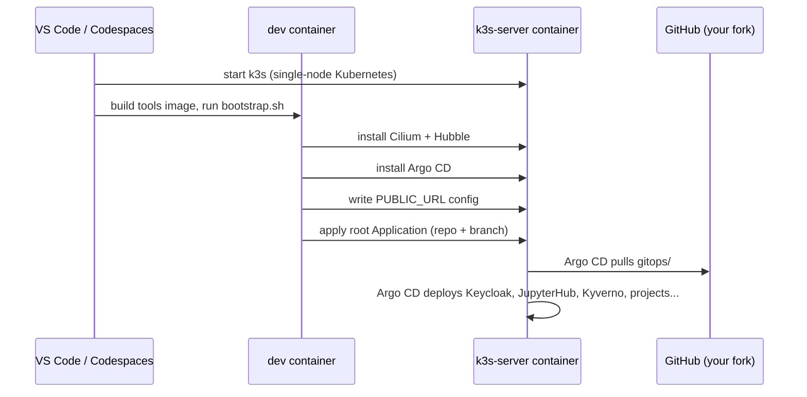

# Getting started

You need **one** of the following:

=== "GitHub Codespaces (recommended)"

    * A GitHub account. The free allowance for personal accounts covers a full-day workshop on a
      4-core machine.
    * A modern browser. Nothing is installed on your computer.

    :arrow_right: [Start in Codespaces](codespaces.md)

=== "Your own machine"

    * **16 GB RAM** or more (Docker needs 8 GB of it; 10 GB is more comfortable)
    * 4 CPU cores and ~20 GB free disk
    * [Docker Desktop](https://www.docker.com/products/docker-desktop/) (Windows/macOS) or
      Docker Engine (Linux)
    * [VS Code](https://code.visualstudio.com/) with the
      [Dev Containers](https://marketplace.visualstudio.com/items?itemName=ms-vscode-remote.remote-containers)
      extension
    * Free TCP port 80, or pick another one (see the local guide)

    :arrow_right: [Run it locally](local.md)

## Fork or clone?

Argo CD, the GitOps engine, deploys the TRE **from GitHub**, not from files on your disk.

* **Fork** the repository if you want to do the GitOps parts of the labs (adding a project by
  pushing a commit). The bootstrap script notices your fork and branch and tells Argo CD to follow
  them.
* **Clone** the upstream repository if you only want to run things. Everything works, but changes
  you make under `gitops/` won't reach the cluster unless you apply them by hand. The labs show
  both ways.

## What happens when the container starts

The bootstrap takes 3–5 minutes; Argo CD then needs another 5–10 minutes to pull images and start
everything. Continue with [First steps](first-steps.md) while it works.
