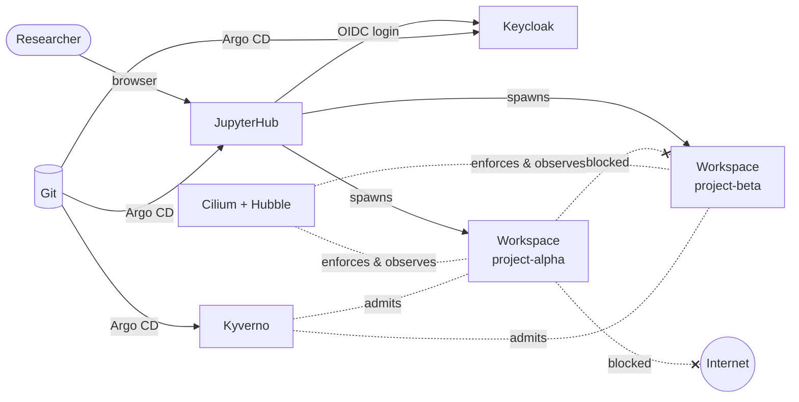

# KID: K8TRE in Docker

**KID** is a hands-on training environment for research software engineers who already work with
Trusted Research Environments (TREs) but are new to **Kubernetes-based** TREs such as
[K8TRE](https://docs.k8tre.org/latest/).

It runs a small but realistic TRE **inside a dev container**, either in GitHub Codespaces or on
your own laptop, so you can launch workspaces, poke at the security controls and break things
without fear.

## What you will learn

| You will be able to explain... | ...and show it working with |
|---|---|
| How a researcher's workspace is created on demand, per project | JupyterHub + KubeSpawner, namespaces |
| How projects are isolated from each other | Cilium network policy, RBAC, per-namespace storage |
| How internet access is blocked by default and allowed by exception | Cilium egress and FQDN policy |
| How to *see* what the network is doing | Hubble CLI and UI |
| How storage is provisioned and scoped | StorageClasses, PersistentVolumeClaims |
| How CPU and memory are limited | Limits, LimitRange, ResourceQuota |
| How guardrails are enforced automatically | Kyverno policies |
| How to assess the security posture of a cluster | Kubescape |
| How the whole platform is declared in Git | Argo CD |

## How to use these docs

1. **[Getting started](getting-started/index.md)**: launch the environment (about 10 minutes, mostly waiting).
2. **[Concepts](concepts/kubernetes-primer.md)**: a short Kubernetes primer written for TRE people,
   and the architecture of this demonstrator.
3. **[Labs](labs/index.md)**: the hands-on part, meant to be done in order.
4. **[Components](components/index.md)** and **[Reference](reference/cheatsheet.md)**: look things up when you need them.

!!! warning "Training only"
    KID is deliberately simplified. It has public passwords, no TLS inside the cluster, no airlock,
    no backups and a single node. **Never put real data in it.** The
    [architecture page](concepts/architecture.md#what-a-production-tre-adds) lists what a
    production TRE adds.

## Relationship to K8TRE

KID follows K8TRE's design choices wherever they matter for learning: Cilium as the CNI,
Argo CD for GitOps, Keycloak for identity, JupyterHub for workspaces and one namespace per
project (`project-<name>`). It leaves out the parts that need real infrastructure or would not
fit on a laptop (cert-manager, External Secrets, Longhorn, CloudNativePG, the cr8tor project
backend, Guacamole desktops, multi-cluster). Once you have finished the labs, the
[K8TRE documentation](https://docs.k8tre.org/latest/) should feel familiar.
